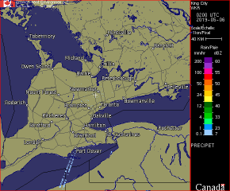
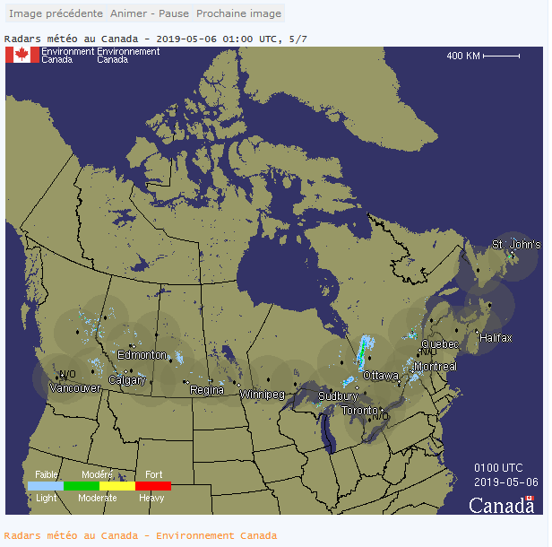

# Environment Canada radar script (for www.weatheroffice.ec.gc.ca)

This script will read the HTML from the Environment Canada radar page (cached) and download/cache the radar images as .png files on your website. Since the EC uses radar graphic names with embedded timestamps, this script offers one of the few ways that weather enthusiasts can include EC radar images in their own websites.

The _ec-radar.php_ script uses a subdirectory (/radar/) to store the contents of the EC radar HTML pages and the current radar graphics. For proper operation of the script, you need to ensure that the /radar directory is writable by PHP scripts. A simple test script is included to check this (_ec-radar-cachetest.php_).

The script will load the HTML page from the EC website (cached) and parse the contents for the radar graphic images available, then download (cache) the images in /radar/radar-AAA-N.png files (AAA=siteid, N=0 (most recent) to 6 (oldest). Then the script will generate HTML and JavaScript to display the graphics from the cache and the associated date stamps for the radar images. The script generates uniquely named JavaScript functions/variables to allow you to embed more than one Radar set on a page (as shown below). For the National (site=NAT) and the regional sites (PAC, WRN, ONT, QUE, and ERN), the radar includes a clickable image map that if clicked, will launch the $linkToPage page (default is $PHP_SELF) to display the new radar site. A smaller (1/4 size) image is also available that will display the words 'N/O - Non Operational' (english) or 'N/O - Non opérationnel' (french) with the time of the last available radar image. The following parameters are available on the ec-radar.php script:

<dl>

<dt>**site=AAA**</dt>

<dd>If present, the script will load radar images from the 'AAA' radar site. The EC radar sites usually begin with X or W and are 3 alphabetic characters long. There are also several meta-site names available:<br>
**site=NAT** - National radar<br>
**site=PAC** - Pacific region <br>
**site=WRN** - Prairies region<br>
**site=ONT** - Ontario region<br>
**site=QUE** - Quebec region<br>
 **site=ERN** - Atlantic region<br>  
</dd>

<dt>**inc=Y**</dt>

<dd>If present, the script will not output surrounding HTML for the page returned. You should specify this if you invoke the script from within your webpage i.e.<br>

```
<?php $doInclude = true; include_once("ec-radar.php"); ?>
```
</dd>

<dt>**lang=en**</dt>

<dd>(Default) Text is in English..</dd>

<dt>**lang=fr**</dt>

<dd>Text is in French .</dd>

<dt>**play=yes**</dt>

<dd>(default)--Start the JavaScript animation when page is loaded.</dd>

<dt>**play=no**</dt>

<dd>Don't start the animation when the page is loaded. Viewer must press play-stop button to start animation.</dd>

<dt>**imgonly=Y**</dt>

<dd>Return a 1/4 size static image of the latest radar selected.  
This is for use in an  statement on your page like this:<br>
```  

```
See example 1 below for usage.  
Note: individual site radar images are width="290" height="240"  
regional site radar images are width="290" height="150"  
National radar image is width="290" height="150"  
</dd>

<dt>**linkto=**</dt>

<dd>This optional parameter is to connect clicks on the map to a different page on your site. The default is to return to the script itself ($PHP_SELF). See example 2 below for possible usage.  
You can set this in the $linkToPage variable in the program instead (to hide the navigation if you like).</dd>

</dl>

For webmaster help with debugging the setup/configuration of the script, the following parameters may also be used:

<dl>

<dt>**cache=no**</dt>

<dd>Forces refresh of EC radar page and radar images .</dd>

</dl>

### Settings inside the script

If you create a writable /radar subdirectory in the document root of your webserver, then the only settings you should change are $siteID and $defaultLang.

```php
// Settings:
// --------- start of settings ----------
// you need to set the $ECURL to the radar image for your site
//
//  Go to http://weather.gc.ca/ and select your language (sorry, I don't
//  speak French, so these instructions are all in English)
//
//  Go to http://weather.gc.ca/radar/index_e.html
//  Click on the radar circle around your city/area.
//  You should see a radar page with an url like
//     https://weather.gc.ca/radar/index_e.html?id=xxx
//  copy the three letter radar id=XXX into $siteID = 'XXX'; below
//
$siteID = 'WKR';      // set to default Site for radar (same as id=xxx on EC website)
//
$defaultLang = 'en';  // set to 'fr' for french default language
//                    // set to 'en' for english default language
//
$cacheName = 'ec-radar.txt';     // note: will be changed to -en.txt or
//                                  -fr.txt depending on language choice and stored in $radarDir
$radarDir = './radar/';           // directory for storing radar-XXX-0.png to radar-XXX-6.png images
//                                  note: relative to document root.
//
$refetchSeconds = 300;  // look for new radar from EC every 5 minutes (300 seconds)
//                      NOTE: EC may take up to 20 minutes to publish new images    
$noRadarMinutes = 25;   // minutes to wait before declaring the radar site as 'N/O -not operational'
//
$aniSec = 1; // number of seconds between animations
//
$linkToPage = '';         // detail url to link to when map link is clicked
//                        default '' will link to this program (ec-radar.php)
$showRivers     = true;   // set to true to include rivers in display
$showRoads	= true;	  // set to true to show major roads (default)
$showRoadLabels = false;  // set to true to show road numbers/labels
$showRoadNumber = false;  // set to true to show road numbers in display
$showRadarRings = false;  // set to true to include range rings in images
$showTowns	= true;   // set to true to include major towns (default)
$showAdditTowns = true;   // set to true to include additional towns in display
$showRegionalTowns = true; // show towns on Regional and National maps
$show14Color    = true;   // set to false to show new 8-color maps, set to true for original 14-color maps
//
$charsetOutput = 'ISO-8859-1';   // default character encoding of output
// ---------- end of settings -----------
```

### Example 1 - Current default radar small image

```

```

Results in:



### Example 2 - Canada National Radar in French

```php
<?php  
$_REQUEST['site'] = 'NAT';  
$_REQUEST['lang'] = 'fr';  
$doInclude = true;
$doAutoPlay = true; // autoplay the images  
include_once("ec-radar.php");  
?>
```

Results in a clickable National radar map with animation (in French)



## Installation Instructions

1.  Upload ec-radar-cachetest.php script to the chosen directory and ./radar directory then run the program from your browser.  
    If the ec-radar-cachetest.php reports success in writing the file and that GD is installed, then proceed to step 2\.  
    If you have error messages appearing, then you'll have to fix the problem on your webserver (by changing the permissions on the ./radar directory to 775 on Linux/Unix systems, or allowing 'all' to read/write/create on IIS system). The ec-radar.php program requires the use of cache files, so you'll have to get a clean run on ec-radar-chachetest.php to have ec-radar.php run successfully.
2.  Check _ec-radar.php_ and make sure the ```$radarDir = '/radar/';``` is set the same as in your ec-radar-cachetest.php file, and change other settings (```$siteID```) as you like.
3.  Upload _ec-radar.php_ to the same directory that successfully ran _ec-radar-cachetest.php_.
4.  View _ec-radar.php_ with your browser. You should see the animation of your local ($siteID) radar.
5.  Install links in your other webpages for the radar images you desire.

Note: this script is included with the [Saratoga Base-Canada template sets (bilingual English/French)](https://saratoga-weather.org/wxtemplates/index.php).
